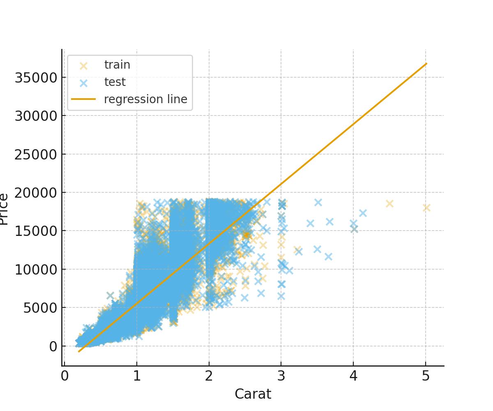
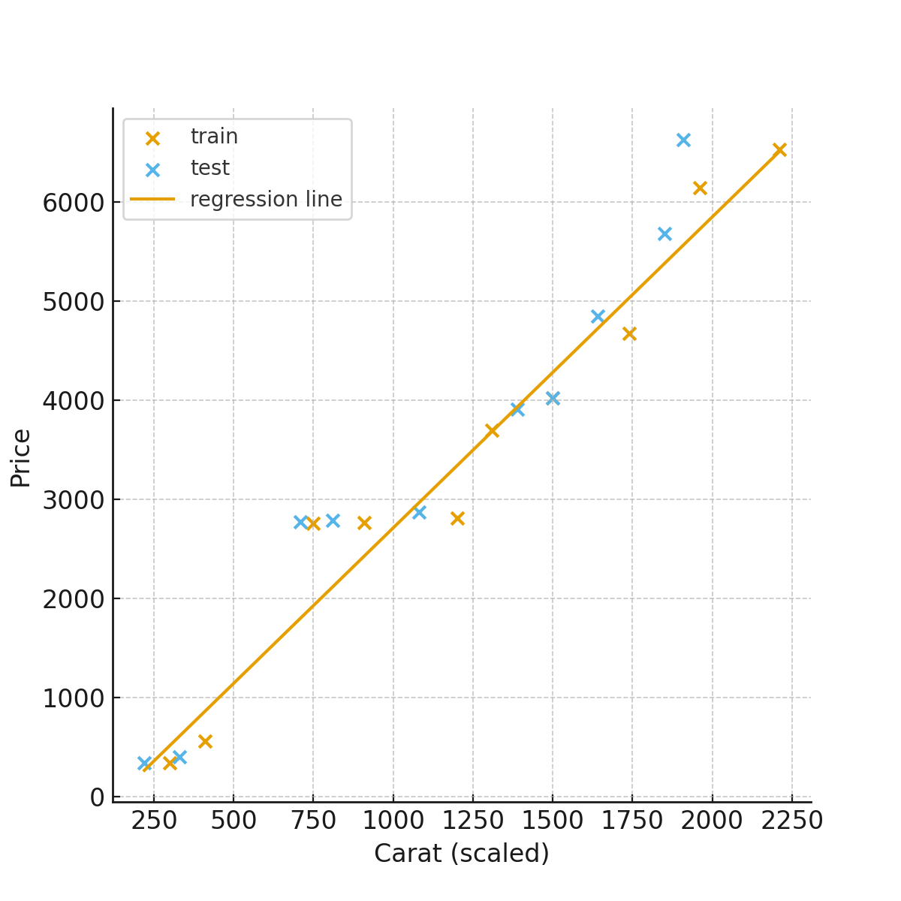

# Ejercicio en clase 01/10/2025.

## Autor  
**Andrés Sebastián Coral Vallejo.** 

El ejercicio de hoy tomó en consideración a [Grokking-Artificial-Intelligence](https://github.com/rishal-hurbans/Grokking-Artificial-Intelligence-Algorithms/tree/master/ch08-machine_learning) como nos indicó el profesor.

---
## 1) Comparación de los resultados entre `ml_linear_regression.py` y `ml_scikitlearn_linear_regression.py`.
---

### A) Modelo manual (archivo ml_linear_regression.py) — dataset pequeño del script

Se usaron 10 datos de entrenamiento (10 ejemplos).

Coeficientes (entrenado sobre $X = carat * 1000$):

 - Pendiente b1 = 3.1385915127885973 (por unidad escalada).

 - Intercepto b0 = −426.3289692171861.

Si convertimos la pendiente a precio por 1 carat (considerando que el código multiplicó $carat×1000$):

 - $Pendiente por 1 carat ≈ 3.1385915 × 1000 = 3138.59 (unidades monetarias por carat).$

 - $R² (forma correcta, comparando price_test vs predicciones) = 0.9269514332 (≈ 0.927).$

### B) Modelo scikit-learn (usando ml_data_preparation.Data con diamonds.csv)

División por defecto en ml_data_preparation.Data:
  - train_test_split(..., test_size=0.5) → 26970 ejemplos en train y 26970 en test (dataset total 53,940).

Regresión lineal (prediciendo price desde carat):
 - $Pendiente (slope) = 7791.112752637774 (precio por 1 carat).$
 - $Intercepto = −2278.5878610780373.$
 - $MSE (test) = 2,394,423.8479396133.$
 - $R² (test) = 0.8488493110150753 (≈ 0.849).$

Observación: Si se re-entrena una versión con $carat * 1000$ para comprobar la escala, se observa que El R² y MSE permanecen iguales;
la pendiente cambia por el factor de escala (como era de esperarse): pendiente ≈ 7.7911 cuando el input es $carat * 1000$ (esto concuerda matemáticamente con la versión sin escalar).

### C) Comparación directa — interpretación práctica.

| Concepto                       |                                 Modelo manual (toy) |                Modelo scikit (diamonds.csv) |
| ------------------------------ | --------------------------------------------------: | ------------------------------------------: |
| Tamaño de entrenamiento        |                                         10 ejemplos |                             26,970 ejemplos |
| Pendiente (precio por 1 carat) |                                        ≈ **3138.6** |                                  **7791.1** |
| Intercepto                     |                                             −426.33 |                                    −2278.59 |
| R² (test, estándar)            | **0.927** (muy alto pero basado en muestra pequeña) | **0.849** (muy razonable en dataset grande) |
| MSE (test)                     |                        pequeño (escala dependiente) |            **~2.39×10⁶** (escala monetaria) |

Ambos modelos indican que el precio aumenta con el carat, pero:
- El toy dataset es muy pequeño y puede dar una pendiente sesgada.
- El dataset real contiene muchos ejemplos y outliers; su pendiente (~7.8k) es más representativa del comportamiento observado en diamonds.csv.
- Los interceptos negativos son artefactos de la extrapolación lineal cerca de carat=0; no implican precios negativos reales.

#### Ejemplos de predicciones comparadas (carat = 0.5, 1.0, 2.0)

| carat | Predicción (modelo manual) | Predicción (modelo scikit) | Diferencia |
| ----: | -------------------------: | -------------------------: | ---------: |
|   0.5 |                    1142.97 |                    1616.97 |     474.00 |
|   1.0 |                    2712.26 |                    5512.52 |    2800.26 |
|   2.0 |                    5850.85 |                   13303.64 |    7452.78 |

A mayores carats, la diferencia entre modelos crece (la pendiente mayor del modelo real hace que la diferencia aumente con la carat).

### D) Gráficas y archivos generados.

    <strong>SCATTER (TRAIN/TEST) + RECTA DE REGRESIÓN (DATASET REAL)</strong>

    <strong>SCATTER DEL TOY (SCRIPT MANUAL) CON RECTA.</strong>

---
## 2) Diseño de modelo de Machine Learning para regresión lineal (Orientado a objetos).
---

